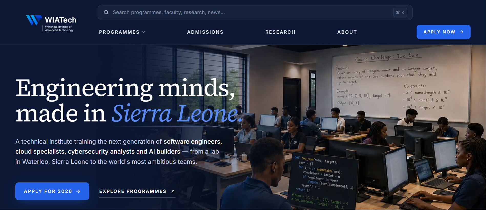

## WIATech Website

WIATech Website is a full-stack web platform for the Waterloo Institute of
Advanced Technology in Sierra Leone. It combines a public institute website,
programme catalogue, admissions pages, applicant portal, staff review dashboard,
payment workflow, email notifications, and audit logging in one Next.js app.

The project is built for three main groups:

- Prospective students exploring WIATech programmes, admissions dates, tuition,
  and institute information.
- Applicants completing and submitting a Cohort 01 application through a
  guided, resumable portal.
- Admissions staff and administrators reviewing applications, assigning
  programme scope, recording recommendations, exporting reports, and preserving
  an audit trail.

  ## Tech Stack

- Framework: Next.js App Router, React 19, TypeScript
- Styling: Tailwind CSS v4, shadcn-style primitives, Radix Slot,
  lucide-react icons
- Auth: Auth.js v5 with Prisma adapter and Resend magic links
- Database: PostgreSQL, Prisma ORM, Prisma migrations
- Background jobs: Inngest
- Email: Resend
- Payments: provider abstraction for mobile-money and manual payment flows
- Validation and utilities: Zod, clsx, tailwind-merge
- Testing and quality: Vitest, Testing Library, happy-dom, ESLint, Prettier
- Deployment target: Vercel-compatible Next.js runtime

> This repository is a portfolio showcase for WIATech. The production source code is maintained in a private repository.

## Screenshot

## Live Site
[→ Visit WIATech](https://wiatech.sl)
